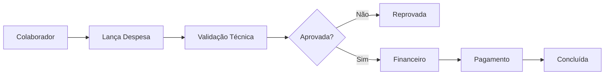
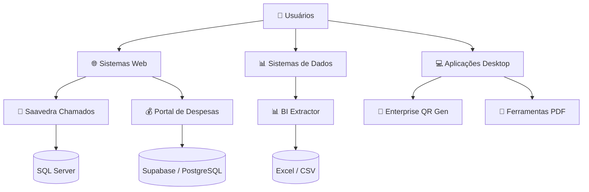

<div align="center">


# 🏢 Ecossistema de Sistemas Saavedra

### Tecnologia aplicada à operação, gestão e inteligência do negócio

<p>
  
  
  
  
</p>

<p>
  <strong>Central de documentação e apresentação das soluções tecnológicas desenvolvidas para a Saavedra.</strong>
</p>

</div>

---

## 🎯 Sobre este Ecossistema

O **Ecossistema de Sistemas Saavedra** reúne aplicações desenvolvidas para apoiar processos internos, operações administrativas, suporte técnico, gestão financeira, análise de dados e automação.

As soluções são projetadas com foco em:

* ⚡ **Eficiência operacional**
* 📊 **Gestão orientada por dados**
* 🔐 **Controle e segurança**
* 🤖 **Automação de processos**
* 🧩 **Integração entre áreas**
* 📈 **Escalabilidade**
* 🏢 **Padronização dos processos internos**

Este repositório funciona como um **catálogo técnico e institucional** das principais soluções mantidas pela área de tecnologia.

---

# 🧭 Sistemas Corporativos

## 🎫 Saavedra Chamados

**Sistema corporativo de gestão de chamados e suporte de TI.**

Centraliza a abertura, triagem, atendimento, acompanhamento e encerramento de solicitações internas.

### Principais recursos

* 🎫 Abertura e acompanhamento de chamados
* 👥 Gestão de usuários e permissões
* 🧑‍💻 Filas e atribuição de técnicos
* ⏱️ Controle de SLA
* 📝 Histórico completo das atividades
* 📎 Gestão de anexos
* 🔒 Notas internas para equipe técnica
* ⭐ Pesquisa de satisfação CSAT
* 📊 Dashboard e indicadores de BI
* 📑 Relatórios gerenciais
* 🔍 Auditoria e rastreabilidade

### Arquitetura

```text
┌─────────────────────┐
│     USUÁRIO         │
│ Solicitante/Técnico │
└──────────┬──────────┘
           │
           ▼
┌─────────────────────┐
│    FRONTEND WEB     │
│    HTML / CSS / JS  │
└──────────┬──────────┘
           │ HTTP / REST
           ▼
┌─────────────────────┐
│     BACKEND API     │
│ Python + FastAPI    │
└──────────┬──────────┘
           │
           ▼
┌─────────────────────┐
│    SQL SERVER       │
│ Dados / SLA / Logs  │
└─────────────────────┘
```

**Tecnologias:** Python, FastAPI, SQLAlchemy, PyODBC, SQL Server, JavaScript e CSS.

**Status:** 🟢 Sistema em evolução

[**Acessar repositório →**](https://github.com/suportesaav-web/saavedra_chamados)

---

## 💰 Portal de Despesas

**Plataforma corporativa para lançamento, validação e pagamento de despesas.**

Substitui processos manuais e planilhas por uma esteira digital de prestação de contas.

### Principais recursos

* 🔐 Autenticação de usuários
* 📝 Lançamento de despesas
* 📎 Upload de comprovantes
* 📊 Dashboard de indicadores
* ✅ Validação técnica
* 💳 Aprovação e liquidação financeira
* 👥 Gestão de colaboradores
* 📈 Relatórios
* 📤 Exportação para CSV/Excel
* 🔑 Controle de permissões por função

### Fluxo operacional



**Tecnologias:** React, Vite, Supabase, PostgreSQL, Supabase Auth e Storage.

**Status:** 🟡 Em desenvolvimento

[**Acessar repositório →**](https://github.com/suportesaav-web/portal_despesas_saavedra)

---

## 📊 The BI Extractor

**Plataforma de tratamento, normalização e análise de dados provenientes do Power BI.**

Transforma dados brutos e hierárquicos em informações estruturadas para análise e integração com ferramentas de BI.

### Principais recursos

* 📥 Importação de Excel e CSV
* 🧹 Higienização automática dos dados
* 🔄 Normalização para formato tabular
* 📊 Mini-BI executivo
* 📈 Indicadores de desempenho
* 🏆 Rankings e comparativos
* 📑 Geração de Excel profissional
* 📤 CSV preparado para Looker Studio
* 📉 Visualizações interativas

### Fluxo

```text
DADOS BRUTOS
     │
     ▼
┌───────────────┐
│   IMPORTAÇÃO  │
└───────┬───────┘
        ▼
┌───────────────┐
│ HIGIENIZAÇÃO  │
└───────┬───────┘
        ▼
┌───────────────┐
│ NORMALIZAÇÃO  │
└───────┬───────┘
        ▼
┌───────────────┐
│     MINI-BI   │
└───────┬───────┘
        ▼
┌────────────────────┐
│ EXCEL / CSV / BI   │
└────────────────────┘
```

**Tecnologias:** Python, Streamlit, Pandas, Openpyxl e Plotly.

**Status:** 🟢 Operacional

[**Acessar repositório →**](https://github.com/suportesaav-web/the-bi-extractor)

---

## 🔲 Enterprise QR Gen

**Aplicação corporativa para geração padronizada de QR Codes institucionais.**

Desenvolvida para geração individual e em lote, com suporte a identidade visual corporativa.

### Principais recursos

* 🔗 Geração de QR Codes
* 🖼️ Inserção de logotipo
* 📦 Geração em massa
* 📋 Cópia direta para clipboard
* 🛡️ Alta correção de erros
* 💻 Execução local/offline
* 🪟 Aplicação desktop Windows
* 🧪 Testes automatizados

**Tecnologias:** Python, CustomTkinter, PIL, Pytest e PyInstaller.

**Status:** 🟢 Estável

[**Acessar repositório →**](https://github.com/suportesaav-web/Enterprise_qr_gen)

---

## 📄 Mesclador PDF

**Ferramenta interna para manipulação e consolidação de documentos PDF.**

Voltada para automatizar tarefas recorrentes relacionadas à preparação e organização de documentos.

**Tecnologia principal:** Python.

**Status:** 🟢 Operacional

[**Acessar repositório →**](https://github.com/suportesaav-web/mesclador-pdf)

---

## ⚙️ The-Nehemizer

**Coleção de automações e ferramentas internas para suporte às operações.**

Projeto destinado à centralização de utilitários e automações desenvolvidos para reduzir atividades manuais e aumentar a produtividade.

**Tecnologia principal:** Python.

[**Acessar repositório →**](https://github.com/suportesaav-web/The-Nehemizer)

---

# 🏗️ Arquitetura do Ecossistema

As soluções utilizam diferentes arquiteturas de acordo com a finalidade de cada sistema.



---

# 🧩 Stack Tecnológica

<div align="center">

### Backend & Dados


### Frontend


### Cloud & Ferramentas


</div>

---

# 🔐 Segurança e Governança

Os sistemas corporativos são desenvolvidos considerando princípios de segurança, controle de acesso e rastreabilidade.

Entre os recursos utilizados conforme a aplicação:

* 🔑 Autenticação
* 👥 Controle de permissões
* 🔒 Hash seguro de credenciais
* 🛡️ Controle de acesso por perfil
* 📝 Logs e auditoria
* 🗃️ Integridade de dados
* 🔐 Proteção de informações corporativas
* 📎 Controle de documentos e anexos

> **Importante:** informações, credenciais, chaves de API, senhas e configurações sensíveis não devem ser armazenadas diretamente no código-fonte ou no repositório.

---

# 📈 Visão de Evolução

O ecossistema está estruturado para evoluir progressivamente de ferramentas isoladas para uma plataforma integrada de sistemas corporativos.

```text
                    ┌─────────────────────┐
                    │   OPERAÇÃO SAAVEDRA │
                    └──────────┬──────────┘
                               │
              ┌────────────────┼────────────────┐
              │                │                │
              ▼                ▼                ▼
        ┌──────────┐     ┌──────────┐     ┌──────────┐
        │ SUPORTE  │     │ FINANCEIRO│    │   BI     │
        │   TI     │     │ DESPESAS │     │ DADOS    │
        └────┬─────┘     └────┬─────┘     └────┬─────┘
             │                │                │
             └────────────────┼────────────────┘
                              ▼
                    ┌─────────────────────┐
                    │ INTELIGÊNCIA        │
                    │ OPERACIONAL         │
                    └─────────────────────┘
```

### Próximas possibilidades

* 🔗 Integração entre sistemas
* 📊 Centralização de indicadores
* 🔐 Single Sign-On
* 🧑‍💼 Gestão centralizada de usuários
* 🔄 Integração via APIs
* 📱 Interfaces responsivas
* 🤖 Ampliação das automações
* 📈 Evolução dos dashboards executivos

---

# 📚 Repositórios

| Sistema                   | Finalidade                     | Tecnologia                    | Status |
| ------------------------- | ------------------------------ | ----------------------------- | :----: |
| 🎫 **Saavedra Chamados**  | Gestão de suporte e chamados   | Python / FastAPI / SQL Server |   🟢   |
| 💰 **Portal de Despesas** | Gestão e aprovação de despesas | React / Supabase              |   🟡   |
| 📊 **BI Extractor**       | Tratamento e análise de dados  | Python / Streamlit            |   🟢   |
| 🔲 **Enterprise QR Gen**  | Geração de QR Codes            | Python / CustomTkinter        |   🟢   |
| 📄 **Mesclador PDF**      | Automação de documentos        | Python                        |   🟢   |
| ⚙️ **The-Nehemizer**      | Automações e utilitários       | Python                        |   🟢   |

---

# 🏢 Organização

**Saavedra Tecnologia em Saúde**

Este ecossistema representa as iniciativas de tecnologia voltadas à digitalização, automação e melhoria contínua dos processos internos.

<div align="center">

### Tecnologia a serviço da operação.

<br>

[](https://github.com/suportesaav-web)

<br><br>

<sub>© 2026 Saavedra — Sistemas Internos e Soluções Tecnológicas</sub>

</div>
