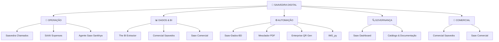

<div align="center">


# 🏢 SAAVEDRA DIGITAL

### Ecossistema de Sistemas e Inteligência Operacional

<p>
  
  
  
  
</p>

**Tecnologia aplicada à operação, gestão, produtividade e inteligência do negócio.**

</div>

---

# 🚀 Sobre o Projeto

O **Saavedra Digital** é o ecossistema de sistemas internos desenvolvido para apoiar a operação da **Saavedra Tecnologia em Saúde**.

O portfólio reúne aplicações web, ferramentas desktop, automações, soluções de dados, integrações com sistemas corporativos e projetos de governança.

O objetivo é transformar necessidades reais do negócio em soluções digitais capazes de:

* ⚡ reduzir trabalho manual;
* 📊 transformar processos em dados;
* 🔍 aumentar rastreabilidade;
* 🤖 automatizar tarefas repetitivas;
* 🔐 melhorar controle e governança;
* 📈 apoiar decisões gerenciais;
* 🧩 integrar diferentes áreas;
* 🚀 criar uma base tecnológica própria para evolução.

---

# 🧭 O Ecossistema



---

# 📚 Portfólio

## 🎫 Saavedra Chamados

### Gestão Corporativa de Serviços de TI

Sistema para abertura, triagem, atendimento, acompanhamento e encerramento das demandas de TI.

**O que mudou:**

Antes, o trabalho da TI tinha pouca capacidade de mensuração estruturada.

Agora, cada demanda pode ser registrada e acompanhada através de um processo formal.

### Recursos

* abertura de chamados;
* prioridades;
* filas;
* técnicos;
* SLA;
* histórico;
* anexos;
* notas internas;
* timeline;
* Kanban;
* causa raiz;
* CSAT;
* indicadores.

### Momento atual

🟢 **Sistema pronto e funcional**

A próxima etapa é a **implantação corporativa**, incluindo apresentação do sistema, treinamento dos usuários e construção de aderência ao novo processo.

**[→ Ver repositório](https://github.com/suportesaav-web/saavedra_chamados)**

---

# ⚙️ Saav-Dados-BD

## Case de Automação Operacional

O **Saav-Dados-BD** é um dos principais cases do ecossistema.

### Antes

O processo de organização e equalização da planilha demandava aproximadamente:

**1 turno e meio de trabalho.**

### Hoje

Com a automação:

**≈ 30 minutos.**

```text
PROCESSO MANUAL
≈ 1,5 turno
       │
       ▼
   AUTOMATIZAÇÃO
       │
       ▼
PROCESSO ATUAL
≈ 30 minutos
```

A solução automatiza o processamento de relatórios de vendas, contratos, propostas e tabelas de preços, permitindo validação e geração do relatório final.

### O que esse case demonstra?

Que tecnologia pode ser utilizada para identificar atividades operacionais de alto esforço e transformá-las em processos automatizados.

**[→ Ver repositório](https://github.com/suportesaav-web/Saav-Dados-BD)**

---

# 📊 Saav Dashboard

## Governança dos Dashboards Sankhya

Projeto dedicado à análise técnica e racionalização dos dashboards utilizados no ERP Sankhya.

O projeto mantém um inventário de:

* **137 dashboards ativos**
* **23 componentes classificados como OFF**

### Integração

Atualmente existe conexão com a **API do Sankhya**, permitindo testar queries diretamente e validar o funcionamento dos dashboards.

```text
DASHBOARD
    │
    ▼
METADADOS
    │
    ▼
QUERY
    │
    ▼
API SANKHYA
    │
    ▼
TESTE / VALIDAÇÃO
    │
    ▼
ANÁLISE
```

### Objetivo

Identificar:

* dashboards duplicados;
* informações redundantes;
* queries semelhantes;
* problemas de funcionamento;
* oportunidades de otimização;
* possibilidades de consolidação.

O objetivo final é construir um ambiente de BI mais organizado, consistente e governado.

**[→ Ver repositório](https://github.com/suportesaav-web/saav-dashboard)**

---

# 📈 Comercial Saavedra

## BI e Inteligência Comercial

Plataforma para transformar dados do CRM Ploomes em informações para acompanhamento da operação comercial.

### Dados analisados

* vendedores;
* clientes;
* atividades;
* tarefas;
* produtividade;
* atrasos;
* oportunidades;
* visitas;
* cobertura comercial.

### Arquitetura

```text
PLOOMES CRM
     │
     ▼
API
     │
     ▼
ETL
     │
     ▼
DADOS TRATADOS
     │
     ▼
BI
     │
     ▼
GESTÃO COMERCIAL
```

A solução cria uma camada de engenharia de dados entre o CRM e os indicadores utilizados pela gestão.

**[→ Ver repositório](https://github.com/suportesaav-web/comercial-saavedra)**

---

# 📊 The BI Extractor

## Engenharia de Dados e Normalização

Ferramenta criada para transformar dados brutos, planilhas e estruturas provenientes de BI em dados organizados para análise.

### Pipeline

```text
ARQUIVOS / IMAGENS
        ↓
EXTRAÇÃO
        ↓
NORMALIZAÇÃO
        ↓
VALIDAÇÃO
        ↓
ANÁLISE
        ↓
EXCEL / CSV / BI
```

### Tecnologias

* Python
* Streamlit
* Pandas
* OpenPyXL
* Plotly
* Google Gemini Vision

**[→ Ver repositório](https://github.com/suportesaav-web/the-bi-extractor)**

---

# 💰 SAAV Expenses

## Gestão Digital de Despesas

Sistema corporativo para lançamento, validação, auditoria e pagamento de despesas.

### Recursos

* autenticação;
* lançamento;
* comprovantes;
* câmera;
* OCR;
* PWA;
* modo offline;
* sincronização;
* aprovação;
* políticas de reembolso;
* auditoria;
* relatórios.

```text
VENDEDOR
   ↓
DESPESA
   ↓
COMPROVANTE
   ↓
VALIDAÇÃO
   ↓
FINANCEIRO
   ↓
LIQUIDAÇÃO
```

**[→ Ver repositório](https://github.com/suportesaav-web/portal_despesas_saavedra)**

---

# 🔲 Enterprise QR Gen

## Geração Corporativa de QR Codes

Ferramenta desktop para geração padronizada de QR Codes.

### Recursos

* geração individual;
* geração em lote;
* logo;
* alta correção de erros;
* clipboard;
* processamento offline;
* Windows.

**[→ Ver repositório](https://github.com/suportesaav-web/Enterprise_qr_gen)**

---

# 📄 Mesclador PDF

## Automação de Documentos

Ferramenta para organização e consolidação de documentos PDF.

### Recursos

* drag & drop;
* múltiplos arquivos;
* ordenação;
* contagem de páginas;
* processamento em segundo plano;
* barra de progresso;
* proteção contra sobrescrita.

**[→ Ver repositório](https://github.com/suportesaav-web/mesclador-pdf)**

---

# 🖼️ IMG_py

## Padronização Visual de Ambientes

Utilitário para criação de ícones e identificadores visuais padronizados.

### Ambientes

`DEV` · `HML` · `PRD` · `TEST` · `ADMIN` · `BETA` · `LOCAL`

### Recursos

* geração de canvas;
* badges;
* textos;
* processamento em lote;
* PNG;
* ICO;
* múltiplas resoluções.

**[→ Ver repositório](https://github.com/suportesaav-web/IMG_py)**

---

# 🌐 Saav Comercial

## Plataforma Web Comercial

Aplicação web baseada em Next.js e TypeScript para evolução da gestão comercial.

### Tecnologias

* Next.js
* TypeScript
* Tailwind CSS
* SWR
* Zustand

### Visão

A plataforma representa uma evolução da camada comercial para uma experiência web mais integrada, conectando dados do CRM, atividades, vendedores, clientes e indicadores.

**[→ Ver repositório](https://github.com/suportesaav-web/saav-comercial)**

---

# 🤖 Agente Saav Sankhya

## Integração TI

Agente para automação e integração focado em TI.

### Momento atual

🟡 **Em evolução**

**[→ Ver repositório](https://github.com/suportesaav-web/agente_saav_sankhya)**

---

# 📌 Casos de Transformação

## 01 — Automação

### Saav-Dados-BD

```text
≈ 1,5 turno
       ↓
AUTOMAÇÃO
       ↓
≈ 30 minutos
```

---

## 02 — Gestão de TI

### Saavedra Chamados

```text
DEMANDAS NÃO ESTRUTURADAS
          ↓
SISTEMA DE CHAMADOS
          ↓
HISTÓRICO + SLA + RESPONSÁVEIS
          ↓
INDICADORES DE TI
```

---

## 03 — Governança de BI

### Saav Dashboard

```text
137 DASHBOARDS
       ↓
ANÁLISE TÉCNICA
       ↓
TESTES VIA API
       ↓
IDENTIFICAÇÃO DE REDUNDÂNCIAS
       ↓
CONSOLIDAÇÃO / PADRONIZAÇÃO
```

---

# 🧠 Da Automação à Inteligência

A evolução do ecossistema pode ser representada em três níveis:

```text
┌─────────────────────────────────────┐
│             INTELIGÊNCIA            │
│                                     │
│       Indicadores / BI / Gestão     │
└──────────────────▲──────────────────┘
                   │
┌──────────────────┴──────────────────┐
│               DADOS                 │
│                                     │
│       Integração / ETL / APIs       │
└──────────────────▲──────────────────┘
                   │
┌──────────────────┴──────────────────┐
│             AUTOMAÇÃO               │
│                                     │
│     Sistemas / Processos / Apps     │
└─────────────────────────────────────┘
```

O objetivo é criar um ciclo contínuo:

**Problema → Sistema → Dados → Indicadores → Governança → Melhoria**

---

# 🏗️ Arquitetura Tecnológica

O ecossistema utiliza diferentes tecnologias conforme a necessidade de cada solução.

### Backend & Dados

* Python
* FastAPI
* Pandas
* SQL Server
* PostgreSQL
* Supabase
* Apache Parquet

### Frontend

* HTML
* CSS
* JavaScript
* React
* Next.js
* TypeScript
* Tailwind CSS

### BI & Analytics

* Streamlit
* Plotly
* Power BI
* Looker Studio
* Sankhya
* Ploomes

### Automação & Inteligência

* APIs
* OCR
* Google Gemini
* processamento de PDF
* processamento de Excel/CSV
* ETL

---

# 🔗 Integrações

O ecossistema já trabalha com diferentes fontes e plataformas:

```text
                    ┌─────────────┐
                    │   SANKHYA   │
                    └──────┬──────┘
                           │ API
                           ▼
                    ┌─────────────┐
                    │    SAAV     │
                    │ DASHBOARD   │
                    └─────────────┘


                    ┌─────────────┐
                    │   PLOOMES   │
                    └──────┬──────┘
                           │ API
                           ▼
                    ┌─────────────┐
                    │  COMERCIAL  │
                    │   SAAVEDRA  │
                    └─────────────┘
```

---

# 📊 Visão do Portfólio

| Projeto               | Área           | Finalidade          | Situação                   |
| --------------------- | -------------- | ------------------- | -------------------------- |
| 🎫 Saavedra Chamados  | TI             | Gestão de serviços  | 🟢 Funcional / implantação |
| 🤖 Agente Saav Sankhya| TI             | Integração          | 🟡 Evolução                |
| ⚙️ Saav-Dados-BD      | Operação       | Automação           | 🟢 Case                    |
| 🔍 Saav Dashboard     | BI             | Governança Sankhya  | 🟡 Evolução                |
| 📈 Comercial Saavedra | Comercial      | BI / CRM            | 🟢 Evolução                |
| 📊 BI Extractor       | Dados          | ETL / BI            | 🟢 Operacional             |
| 💰 SAAV Expenses      | Financeiro     | Gestão de despesas  | 🟡 Evolução                |
| 🔲 Enterprise QR Gen  | TI             | QR Codes            | 🟢 Estável                 |
| 📄 Mesclador PDF      | Administrativo | Documentos          | 🟢 Operacional             |
| 🖼️ IMG_py            | TI             | Padronização visual | 🟢 Operacional             |
| 🌐 Saav Comercial     | Comercial      | Plataforma Web      | 🟡 Evolução                |

---

# 📈 Indicadores do Ecossistema

### 10+

**projetos e soluções catalogados**

### 137

**dashboards Sankhya ativos catalogados**

### 23

**componentes classificados como OFF**

### 2

**principais plataformas corporativas integradas**

**Sankhya + Ploomes**

### 4+

**áreas de negócio atendidas**

TI · Comercial · Financeiro · Operação

---

# 🎯 Próximos Passos

A evolução do ecossistema pode seguir algumas linhas principais:

### 01. Adoção

Consolidar os sistemas já funcionais através de:

* treinamento;
* documentação;
* comunicação;
* acompanhamento de utilização;
* coleta de feedback.

### 02. Integração

Conectar sistemas e fontes de dados para reduzir duplicidade de informações.

### 03. Governança

Criar padrões para:

* desenvolvimento;
* dados;
* dashboards;
* APIs;
* segurança;
* documentação.

### 04. Inteligência

Transformar os dados produzidos pelos sistemas em indicadores gerenciais.

### 05. Automação

Identificar novos processos que ainda dependem de:

* planilhas;
* conferências manuais;
* copiar/colar;
* consolidação de arquivos;
* tarefas repetitivas.

---

# 🏢 Saavedra Tecnologia em Saúde

Este repositório representa a iniciativa de construção de um ecossistema próprio de tecnologia para apoiar a operação da Saavedra.

Mais do que desenvolver sistemas, o objetivo é criar uma estrutura tecnológica capaz de:

**automatizar processos, organizar informações, gerar dados e apoiar a evolução do negócio.**

---

<div align="center">

## Tecnologia a serviço da operação.

**SAAVEDRA DIGITAL**

<br>

[](https://github.com/suportesaav-web)

<br><br>

<sub>© 2026 Saavedra Tecnologia em Saúde</sub>

</div>
